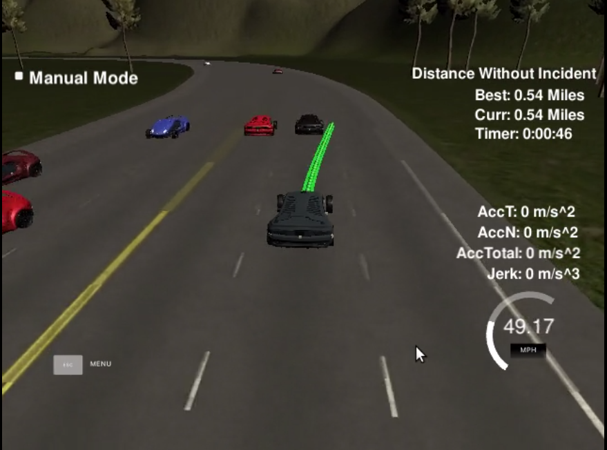

# Path Planning

Self-Driving Car Engineer Nanodegree Program

[](http://www.udacity.com/drive)



[Resulting Video](https://youtu.be/teBoJf_Xe7o)

## Overview/Goals

[This](https://github.com/udacity/CarND-Path-Planning-Project) repository contains all instructions for the Project.

In this project our goal is to safely navigate around a virtual highway with other traffic that is driving +-10 MPH of the 50 MPH speed limit. We're provided the car's localization and sensor fusion data, there is also a sparse map list of waypoints around the highway. The car should try to go as close as possible to the 50 MPH speed limit, which means passing slower traffic when possible, note that other cars will try to change lanes too. The car should avoid hitting other cars at all cost as well as driving inside of the marked road lanes at all times, unless going from one lane to another. The car should be able to make one complete loop around the 6946m highway. Since the car is trying to go 50 MPH, it should take a little over 5 minutes to complete 1 loop. Also the car should not experience total acceleration over 10 m/s^2 and jerk that is greater than 10 m/s^3.

## Reflection

**According the rubric the car was programmed to do the following:**

* the car is able to drive at least 4.32 miles without incident
* the car drives according to the speed limit
* max acceleration and jerk are not exceeded
* car does not have collisions
* the car stays in its lane, except for the time between changing lanes
* the car is able to change lanes
---
**Overall implementation devided in sections:**

* read 'telemetry' and get information about our car
* set parameters for later use
```c++
// parameters
double dt = 0.02; // timestep equal 0.02s
double speed_limit = 49.5;
double safe_dist_front = 20;
double safe_dist_behind = 10;
bool too_close = false; // if other car is too close
bool too_close_left = false; // if other car from the left is too close
bool too_close_right = false; // if other car from the right is too close
bool too_close_behind = false; // if other car from behind is too close
double dist_left = 1000; // gap
double dist_right = 1000; // gap
double ref_speed = 0;  // follow car ahead if can't go left or right
```
* read sensor fusion data and loop through every detected vehicle:
  * calculate speed
  * predict
  * check if vehicle is in close proximity to our car
  * using frenet coords data (d coordinate) get vehicles' lane
  * decide if we can go left or right if needed
  * check if there is enough space from behind
  * calculate gaps from left and from right in order to choose where to go if needed
  * check if we are too close to vehicle ahead

* make a decision of what to do next based on the information we got in previous steps
* control speed according speed limits and vehicles' proximity
* generate trajectory (using c++ cubic spline library and detailed help from [project walkthrough video](https://www.youtube.com/watch?v=7sI3VHFPP0w))

## Basic Build Instructions

1. Clone this repo.
2. Make a build directory: `mkdir build && cd build`
3. Compile: `cmake .. && make`
4. Run it: `./path_planning`.


## Dependencies

* cmake >= 3.5
 * All OSes: [click here for installation instructions](https://cmake.org/install/)
* make >= 4.1
  * Linux: make is installed by default on most Linux distros
  * Mac: [install Xcode command line tools to get make](https://developer.apple.com/xcode/features/)
  * Windows: [Click here for installation instructions](http://gnuwin32.sourceforge.net/packages/make.htm)
* gcc/g++ >= 5.4
  * Linux: gcc / g++ is installed by default on most Linux distros
  * Mac: same deal as make - [install Xcode command line tools]((https://developer.apple.com/xcode/features/)
  * Windows: recommend using [MinGW](http://www.mingw.org/)
* [uWebSockets](https://github.com/uWebSockets/uWebSockets)
  * Run either `install-mac.sh` or `install-ubuntu.sh`.
  * If you install from source, checkout to commit `e94b6e1`, i.e.
    ```
    git clone https://github.com/uWebSockets/uWebSockets 
    cd uWebSockets
    git checkout e94b6e1
    ```

